  

  

 

## `01 / SYSTEM ID`

<table>
  <tr>
    <td width="64%" valign="top">
      <pre><code>$ whoami
Benhao Qu — Backend Engineer
Guangzhou, China · Writing code since 2014

$ focus --now
Distributed Systems / AI Tooling / Developer Productivity</code></pre>
    </td>
    <td width="36%" valign="top">
      
<code>STATUS</code>&nbsp;&nbsp; ACTIVE

      
<code>ORIGIN</code>&nbsp;&nbsp; GUANGZHOU, CN

      
<code>SINCE</code>&nbsp;&nbsp;&nbsp; 2014

      
<code>TIME</code>&nbsp;&nbsp;&nbsp;&nbsp; UTC+08:00

    </td>
  </tr>
</table>

## `02 / SELECTED SYSTEMS`

<table>
  <tr>
    <td width="50%" valign="top">
      <h3><a href="https://github.com/QuBenhao/LeetCode">LeetCode ↗</a></h3>
      
Local problem-solving system with a custom runner, solution templates, and progress tracking.

      
<code>Python</code> <code>Automation</code> <code>CLI</code>

    </td>
    <td width="50%" valign="top">
      <h3><a href="https://github.com/QuBenhao/distributed-system">distributed-system ↗</a></h3>
      
MIT 6.5840 labs: Raft consensus, fault-tolerant key-value services, and sharded storage.

      
<code>Go</code> <code>Raft</code> <code>Distributed Systems</code>

    </td>
  </tr>
  <tr>
    <td width="50%" valign="top">
      <h3><a href="https://github.com/QuBenhao/xv6-lab">xv6-lab ↗</a></h3>
      
MIT 6.S081 kernel labs covering syscalls, virtual memory, storage, and scheduling.

      
<code>C</code> <code>Kernel</code> <code>Operating Systems</code>

    </td>
    <td width="50%" valign="top">
      <h3><a href="https://github.com/QuBenhao/LeetCodeMCP">LeetCodeMCP ↗</a></h3>
      
MCP server exposing problem-solving workflows as tools for AI coding assistants.

      
<code>Python</code> <code>MCP</code> <code>AI Tooling</code>

    </td>
  </tr>
  <tr>
    <td width="50%" valign="top">
      <h3><a href="https://github.com/QuBenhao/gopushdeer">gopushdeer ↗</a></h3>
      
Lightweight PushDeer SDK for sending cross-platform push notifications from Go.

      
<code>Go</code> <code>SDK</code> <code>Notifications</code>

    </td>
    <td width="50%" valign="top">
      <h3><a href="https://github.com/QuBenhao/triage">triage ↗</a></h3>
      
Privacy-first LLM gateway for policy routing, redaction, and spend control across local and remote models.

      
<code>Go</code> <code>LLM Gateway</code> <code>Privacy</code>

    </td>
  </tr>
</table>

## `03 / SYSTEM MATRIX`

<table>
  <tr>
    <td width="50%" valign="top">
      <h3><code>CORE // BACKEND RUNTIME</code></h3>
      REQUEST PATHS · CONCURRENCY · SERVICE RUNTIME
        
      Kitex · gRPC · Nginx · Linux · JVM · Coroutines
    </td>
    <td width="50%" valign="top">
      <h3><code>STATE // DATA &amp; MESSAGING</code></h3>
      STORAGE · CACHE · EVENT STREAMS
        
      Redis · MySQL · PostgreSQL · MongoDB · Kafka
    </td>
  </tr>
  <tr>
    <td width="50%" valign="top">
      <h3><code>EDGE // INFRASTRUCTURE</code></h3>
      CONTAINERS · ORCHESTRATION · NETWORK
        
      Kubernetes · Docker · Docker Compose · Cloudflare · WireGuard
    </td>
    <td width="50%" valign="top">
      <h3><code>INTEL // AI TOOLING</code></h3>
      LOCAL MODELS · AGENT PROTOCOLS · DEVELOPER WORKFLOWS
        
      LLM Integration · MCP · Ollama · MLX · OpenClaw · Claude Code
    </td>
  </tr>
</table>

 

  <samp>“The best code solves the problem elegantly.”</samp>
    
  GUANGZHOU, CN // UTC+08:00 // OPEN TO INTERESTING COLLABORATIONS

