

  

  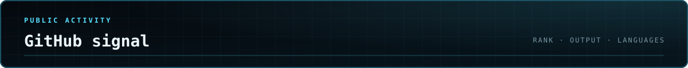

  

  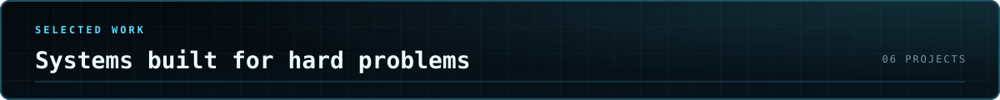

  <a href="https://github.com/QuBenhao/LeetCode">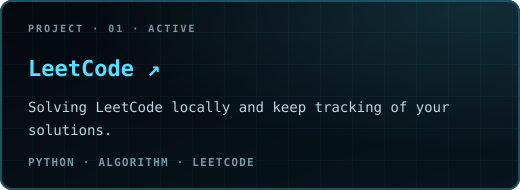</a><a href="https://github.com/QuBenhao/distributed-system">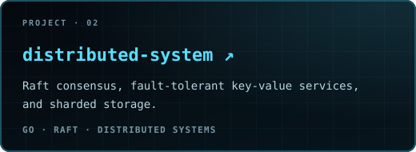</a> 
  <a href="https://github.com/QuBenhao/xv6-lab">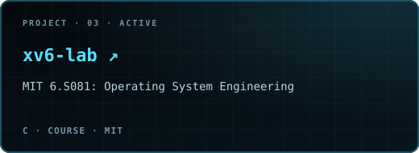</a><a href="https://github.com/QuBenhao/LeetCodeMCP">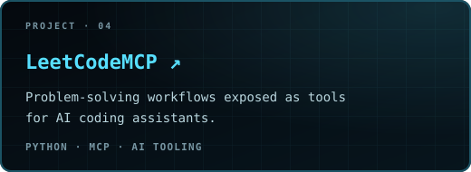</a> 
  <a href="https://github.com/QuBenhao/gopushdeer">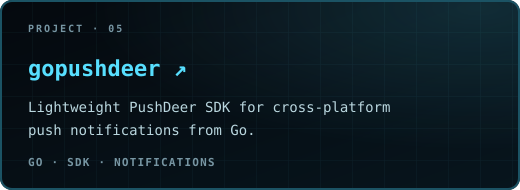</a><a href="https://github.com/QuBenhao/triage">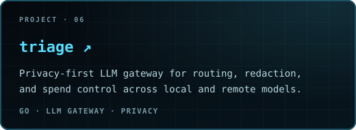</a>

  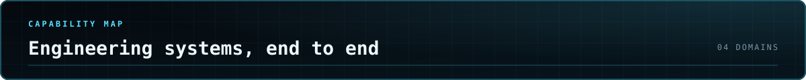

  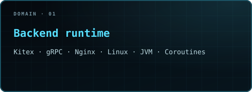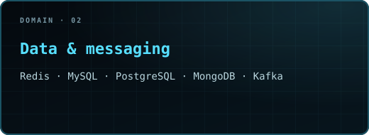 
  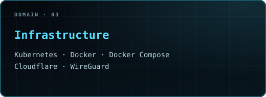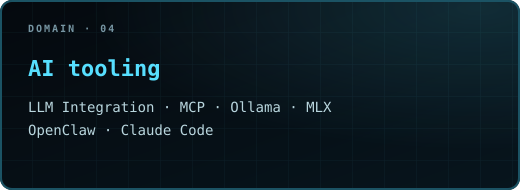

  

